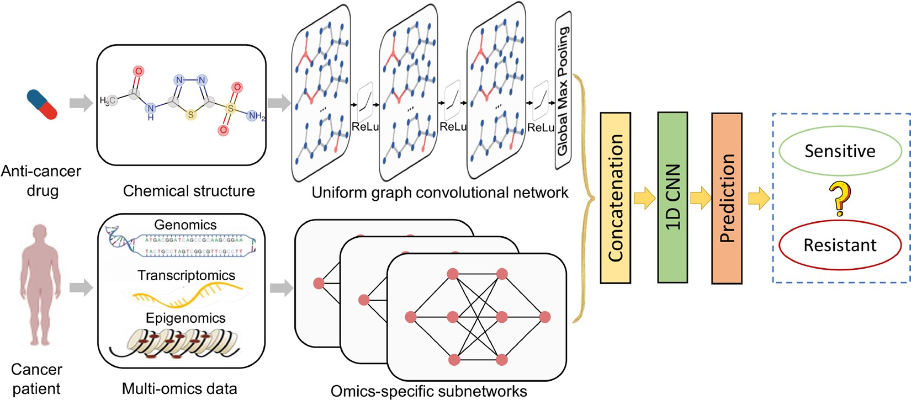

# DeepCDR: a hybrid graph convolutional network for predicting cancer drug response

<p align="center">
    
</p>

**Source**: [*DeepCDR: a hybrid graph convolutional network for predicting cancer drug response*](https://academic.oup.com/bioinformatics/article/36/Supplement_2/i911/6055929).

## Overview
In this repository, I implemented DeepCDR, a multimodal network designed to predict cancer drug response from IC50 values, built from scratch.

## Inference Results

| Classification Performance | Value  | Regression Performance | Value  |
|----------------------------|--------|------------------------|--------|
| Cross Entropy              | 3.9392 | Root Mean Square Error | 5.0984 |
| Balanced Accuracy          | 0.8882 | Pearson Correlation    | 0.9120 |

## Installation
```bash
pip install -r requirements.txt
```

## Train Configuration
```yaml
output_dim: 100
dropout_prob: 0.1

mode: classification
seed: 42
epochs: 50
batch_size: 64
weight_decay: 1.0e-5
learning_rate: 1.0e-4
eta_min: 1.0e-6
```

## Training
```bash
# Enter src directory
cd src/

# Train model
python train.py
```

## Inference Configuration
```yaml
batch_size: 20
mode: classification
identifier: 01-26-2025_15-hrs
weights: highest-balanced-accuracy.pth
```

## Inference
```bash
# Enter src directory
cd src/

# Run Inference
python inference.py
```

Upon running inference, a table with the results for each sample will be saved in `assets/inference-tables/{model_task}/{experiment_id}/results.csv`.

Each table will contain the following fields per sample for downstream analysis:

- **loss**
- **prediction**
- **target**
- **cell_line_id**
- **cancer_type**
- **drug_id**